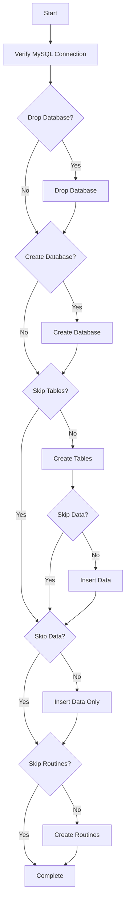

# Production Database Deployment Guide

This folder contains scripts to deploy the `matrimony_services` production database from cleaned SQL dumps.

## 📁 Structure

```
prod-database/
├── Deploy/                              # This folder
│   ├── deploy-prod-database.ps1         # Main deployment script
│   ├── deploy-prod-database.bat         # Batch wrapper for easy execution
│   ├── DEPLOYMENT_README.md             # This file
│   └── QUICK_START.md                   # Quick reference guide
├── initial-data/                        # Data files (separate from tables)
│   ├── matrimony_services_*_data.sql    # INSERT statements for each table
│   └── README.md                        # Data folder documentation
├── create_database.sql                  # Database creation script
├── matrimony_services_*.sql             # Table definitions (DDL only)
└── matrimony_services_routines.sql      # Stored procedures and functions
```

## 🚀 Quick Start

### Option 1: Using Batch File (Easiest)
Double-click `deploy-prod-database.bat` or run from command prompt:
```batch
deploy-prod-database.bat
```

### Option 2: Using PowerShell Directly
```powershell
.\deploy-prod-database.ps1
```

## 📋 Prerequisites

1. **MySQL Server 8.0+** installed
2. **MySQL binary path**: Update `$MySQLBin` in the script if your MySQL is not at the default location:
   - Default: `C:\Program Files\MySQL\MySQL Server 8.0\bin\mysql.exe`
3. **Database credentials** with CREATE, DROP, INSERT, and EXECUTE privileges

## 🎯 Usage Examples

### Basic Deployment (Default)
Creates database if not exists, creates all tables with data, and creates routines:
```powershell
.\deploy-prod-database.ps1
```

### Custom MySQL Credentials
```powershell
.\deploy-prod-database.ps1 -MySQLUser "admin" -MySQLPassword "YourPassword123"
```

### Different MySQL Host
```powershell
.\deploy-prod-database.ps1 -MySQLHost "192.168.1.100" -MySQLUser "admin" -MySQLPassword "pwd"
```

### Drop and Recreate Database
```powershell
.\deploy-prod-database.ps1 -DropExisting
# OR
.\deploy-prod-database.ps1 -DropDatabase -CreateDatabase
```

### Tables Only (No Data or Routines)
```powershell
.\deploy-prod-database.ps1 -TablesOnly
```

### Skip Data (Structure and Routines Only)
```powershell
.\deploy-prod-database.ps1 -SkipData
```

### Skip Routines (Tables and Data Only)
```powershell
.\deploy-prod-database.ps1 -SkipRoutines
```

### Deploy Only Data (Tables Must Already Exist)
```powershell
.\deploy-prod-database.ps1 -DataOnly
```

### Deploy Only Routines (Database Must Already Exist)
```powershell
.\deploy-prod-database.ps1 -RoutinesOnly
```

## 🔧 Parameters

| Parameter | Type | Default | Description |
|-----------|------|---------|-------------|
| `-MySQLHost` | String | `localhost` | MySQL server hostname or IP address |
| `-MySQLUser` | String | `root` | MySQL username |
| `-MySQLPassword` | String | `NewStrongPassword123!` | MySQL password |
| `-DropDatabase` | Switch | Off | Drop existing database before deployment |
| `-CreateDatabase` | Switch | Off | Create database (auto-enabled if not exists) |
| `-DropExisting` | Switch | Off | Drop and create database (shortcut) |
| `-SkipTables` | Switch | Off | Skip table creation |
| `-SkipData` | Switch | Off | Skip data insertion |
| `-SkipRoutines` | Switch | Off | Skip stored procedures/functions |
| `-TablesOnly` | Switch | Off | Create only tables (no data or routines) |
| `-DataOnly` | Switch | Off | Insert only data (tables must exist) |
| `-RoutinesOnly` | Switch | Off | Create only routines (database must exist) |

## 📊 Deployment Flow



## 📝 What Gets Deployed

### 1. Database Creation
- Creates `matrimony_services` database with UTF8MB4 charset

### 2. Tables (26 tables)
All table files matching pattern `matrimony_services_*.sql` (DDL only):
- `account` - User account information
- `activity_log` - System activity tracking
- `api_clients` - API client configurations
- `country` - Country reference data
- `login` - User login credentials
- `login_history` - Login history tracking
- `lookup_table` - Various lookup/reference data
- `profile_*` - Profile-related tables (address, contact, education, etc.)
- `registered_partner` - Partner registration data
- `state` - State reference data
- `stripe_payment_intents` - Payment transaction data
- `test` - Test table

### 3. Data (Optional - in `initial-data/` folder)
Data is **separated** from table definitions:
- **13 data files** with INSERT statements
- Includes reference data (countries, states, lookup values)
- Includes production data (accounts, profiles, etc.)
- Deploy only when needed using `-DataOnly` or omit with `-SkipData`

### 4. Routines (Stored Procedures & Functions)
All routines from `matrimony_services_routines.sql`:
- Account management procedures
- Profile operations
- Authentication procedures
- Data validation functions
- Admin operations
- And more...

## ⚠️ Important Notes

1. **Backup First**: Always backup your existing database before running with `-DropExisting`
2. **Password Security**: For production, use environment variables or secure credential storage
3. **Data Separation**: Data is now in `initial-data/` folder, separate from table definitions
4. **Data Control**: Use `-SkipData` to create empty tables, or deploy data later with `-DataOnly`
5. **Data Order**: Data files are deployed in alphabetical order
6. **Error Handling**: Script continues on non-critical errors but reports them
7. **Large Files**: Some files (activity_log, routines) are large and may take time

## 🔍 Troubleshooting

### "Cannot connect to MySQL server"
- Verify MySQL service is running
- Check hostname, username, and password
- Ensure firewall allows MySQL connections

### "MySQL binary not found"
- Update `$MySQLBin` variable in `deploy-prod-database.ps1`
- Example: `$MySQLBin = "D:\MySQL\bin\mysql.exe"`

### "Failed to create table"
- Check if database exists
- Verify user has CREATE TABLE privilege
- Check for syntax errors in SQL files

### "Failed to create routines"
- Ensure tables exist before creating routines
- Verify user has CREATE ROUTINE privilege
- Check for DEFINER issues (should be removed in cleaned files)

## 🔄 Re-deployment Scenarios

### Update Tables Only (No Data)
```powershell
.\deploy-prod-database.ps1 -DropExisting -TablesOnly
# OR
.\deploy-prod-database.ps1 -DropExisting -SkipData -SkipRoutines
```

### Refresh Data Only
```powershell
# Option 1: Recreate everything and load data
.\deploy-prod-database.ps1 -DropExisting

# Option 2: Only reload data (tables must exist)
.\deploy-prod-database.ps1 -DataOnly
```

### Update Routines Only
```powershell
.\deploy-prod-database.ps1 -RoutinesOnly
```

## 📞 Support

For issues or questions:
1. Check the error messages in the console output
2. Verify all prerequisites are met
3. Review the SQL files for any syntax issues
4. Check MySQL error logs

## 📄 Version History

- **v1.0** - Initial deployment script for cleaned production database dumps
  - Supports full deployment, partial deployment, and skip options
  - Handles embedded data in table files
  - Consolidated routines file support
